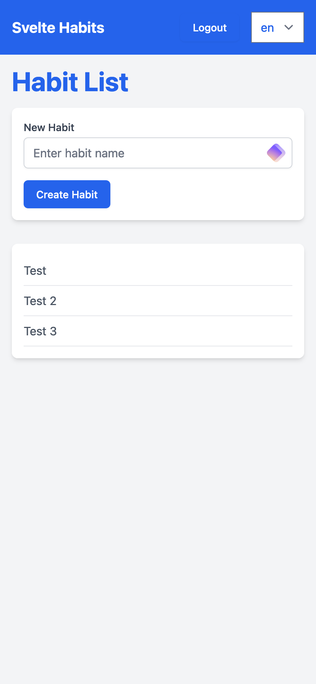
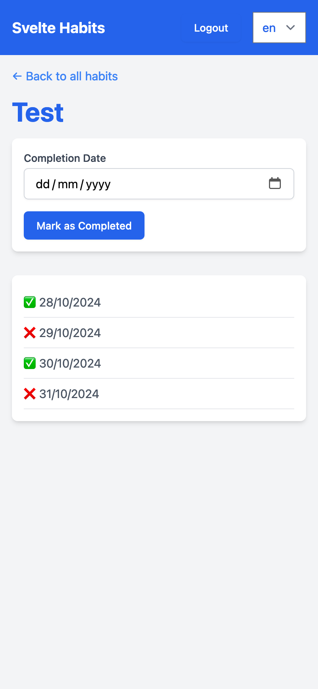

# Svelte Habits

A lightweight habit tracker built with SvelteKit and Svelte 5.

## Running the project

```bash
npm install
npm run db:push
npm run dev -- --open
```

## Screenshots

<details>
<summary>Home page with language selection</summary>

</details>

<details>
<summary>Habit list</summary>

</details>

<details>
<summary>Habit entries</summary>

</details>
